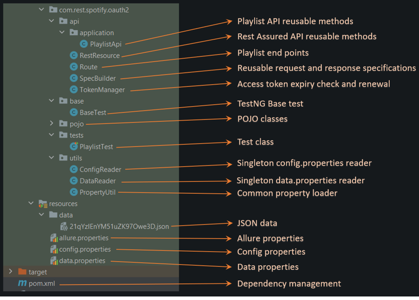

# Rest-Assured TestNG Framework

## Framework goals
- Scalable and extensible
- Reusable Rest Assured specifications
- Reusable Rest Assured API requests
- Separation of API layer from test layer
- POJOs for Serialization and Deserialization
- Singleton Design Pattern
- Lombok for reducing Boilerplate code
- Builder pattern for Setter methods in POJOs
- Robust reporting and logging using Allure
- Automate positive and negative scenarios
- Support parallel execution
- Data driven using TestNG Data Provider
- Automated access token renewal
- Maven command line execution
- Integration with Git
- Integration with Jenkins

## Tools and Technologies

- Rest Assured
- TestNG
- Java
- Allure Reports
- Hamcrest
- Jackson API
- Lombok

## What are we automating?

Spotify Playlists API using the OAuth 2.0 flow [Authorization Code Grant Flow]

&check; Create a Playlist

&check; Get a Playlist

&check; Change a Playlist’s Details

## Test Cases:

&check; shouldBeAbleToCreateAPlaylist

&check; shouldNotBeAbleToCreateAPlaylistWithoutName

&check; shouldNotBeAbleToCreateAPlaylistIfTokenIsExpired

&check; shouldBeAbleToFetchAGivenPlaylist

&check; shouldBeAbleToUpdateAGivenPlaylist

## Framework’s Structure
